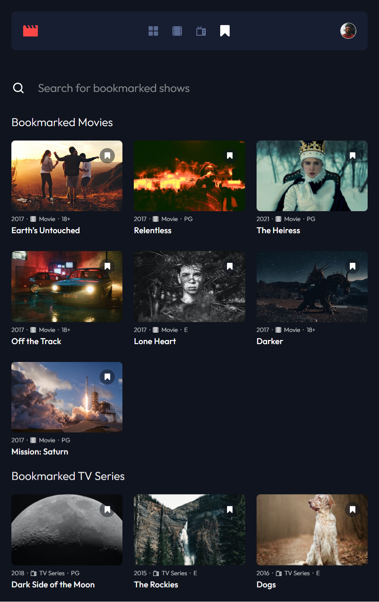
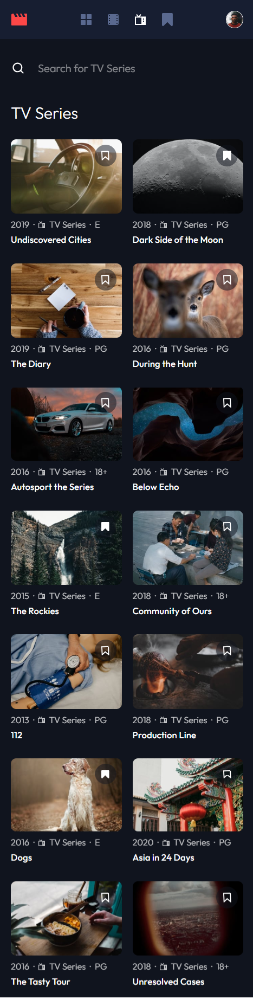

# Frontend Mentor - Entertainment web app solution

This is a solution to the [Entertainment web app challenge on Frontend Mentor](https://www.frontendmentor.io/challenges/entertainment-web-app-J-UhgAW1X). Frontend Mentor challenges help you improve your coding skills by building realistic project.

## Table of contents

-   [Overview](#overview)
    -   [The challenge](#the-challenge)
    -   [Screenshots](#screenshots)
    -   [Links](#links)
-   [My process](#my-process)
    -   [Built with](#built-with)
    -   [What I learned](#what-i-learned)
-   [Author](#author)

## Overview

### The challenge

Users should be able to:

-   View the optimal layout for the app depending on their device's screen size
-   See hover states for all interactive elements on the page
-   Navigate between Home, Movies, TV Series, and Bookmarked Shows pages
-   Add/Remove bookmarks from all movies and TV series
-   Search for relevant shows on all pages

### Screenshots

-   Desktop


-   Tablet



-   Mobile



### Links

-   Solution URL: [https://www.frontendmentor.io/solutions/responsive-web-app-using-react-typescript-and-postcss-6EgxjS_kdM](https://www.frontendmentor.io/solutions/responsive-web-app-using-react-typescript-and-postcss-6EgxjS_kdM)
-   Live Site URL: [https://fem-entertainment-web-app-six.vercel.app/](https://fem-entertainment-web-app-six.vercel.app/)

## My process

### Built with

-   Semantic HTML5 markup
-   CSS custom properties
-   Flexbox
-   CSS Grid
-   [Vite](https://vitejs.dev/) - Build tool
-   [React](https://reactjs.org/) - JS library
-   [PostCSS](https://postcss.org/) - A tool for transforming styles with JS plugins
-   [TypeScript](https://www.typescriptlang.org/) - A syntactic superset of JavaScript which adds static typing

### What I learned

-   Flexbox's direction is based on the writing mode, so in order to easily control the flex direction of both the `header` (which is a flexbox), and its child `nav` (also a flexbox), I simply changed the writing mode on the parent `header` inside a media query.

```css
header {
    writing-mode: var(--writing-mode, horizontal-tb);

    @media (min-width: 1100px) {
        --writing-mode: vertical-rl;
    }
}
```

-   In order to allow desktop users to use their mouse to scroll the **Trending** carousel I had create a few functions.

```typescript
function setMouseLocation(event: React.MouseEvent) {
    /* IF statement checks to see if MOUSEDOWN event is being triggered inside the TRENDING carousel */
    if (isTrending) {
        /* Save mouse location to state */
        const clientX = event.clientX
        set_mousedown_location(clientX)
        set_mouse_is_down(true)
    }
}

function resetMouseState() {
    /* resets mouse state on MOUSELEAVE or MOUSEUP */
    if (isTrending) {
        set_mouse_is_down(false)
    }
}

function handleMouseMove(event: React.MouseEvent) {
    if (!mouse_is_down) return
    /* while mouse is pressed down, state keeps track of how far the mouse has moved along the X-axis, updating the carousel's position */
    const clientX = event.clientX
    const offset = mousedown_location - clientX

    if (scroller.current) {
        scroller.current.scrollLeft += offset * 0.8
        set_mousedown_location(clientX)
    }
}
```

## Author

-   Website - [Jeuri Morel](https://www.jeurimorel.com)
-   Frontend Mentor - [@JeuriMorel](https://www.frontendmentor.io/profile/JeuriMorel)
-   Twitter - [@codeToPerdition](https://www.twitter.com/codeToPerdition)
